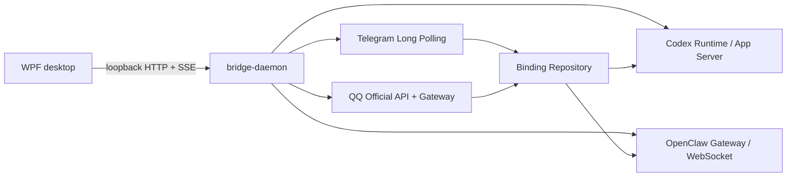

# 架构

CloudLight Codex Bridge 1.2.1 由 WPF、仅监听回环地址的 Go daemon、Codex App Server、全局 Conversation Number Registry、统一远程指令注册表、Mirror Service、统一只读 Query Service、Telegram Adapter 与 QQ Official Bot Adapter 组成。WPF 只消费本机 DTO/SSE；平台原始类型不会进入 Runtime、Binding Repository 或 Codex 控制层。

## OpenClaw Backend MVP

OpenClaw 是可选的第二个会话后端。`internal/conversation` 定义后端无关的会话、发送、停止、事件订阅和连接状态接口；现有 Codex runtime 通过薄适配器暴露该接口，OpenClaw 则由 `internal/openclaw` 独立维护 WebSocket 生命周期。Codex 的 App Server、持久化验证和审批流程不经过 OpenClaw 分支。

OpenClaw 连接行为根据本机 OpenClaw Gateway 当前运行时和 OpenClawTray 实际配置核对得到：Gateway 使用 loopback `ws://`，先发送 `connect.challenge`，Bridge 再以 protocol 4 发送 `connect` request，认证使用配置中的 shared token（也兼容 password 字段），请求 operator read/write/admin scopes。连接成功后 Bridge 订阅 `sessions.subscribe`，读取 `sessions.list`，用 `chat.history` 展示历史；新消息使用 `chat.send`，停止使用 `chat.abort`，最终回答和增量来自 `chat` event 的 `delta` / `final` / `aborted` / `error` 状态。

Bridge 记录 Gateway `tick` 作为健康信号，用 watchdog 关闭无 tick 的连接，断线按 1 秒起步、指数退避至 30 秒重连，并在重连后重新订阅和刷新 Session。事件按 Gateway sequence/run/session 去重。应用退出会取消本地连接、挂起请求和 watchdog，不会让 OpenClawTray 参与 QQ 或 Telegram 的 Bot 消费。

## QQ Official Bot 边界

`internal/qqbot` 实现现有 `ChannelAdapter`。认证使用 AppID + AppSecret 请求短期 Access Token；TokenProvider 在内存缓存到期时间、提前刷新并用单飞控制并发刷新。API 401 只触发一次受控刷新。AppSecret 由 WPF 的独立 DPAPI 文件长期保存，daemon 只持有运行期内存副本。

当前协议使用正式 API、`GET /gateway`（仅在 404 时兼容旧 `/gateway/bot`）、Gateway Hello/Identify/READY、Heartbeat/ACK、sequence、session、Resume、Reconnect 与 Invalid Session。Identify 只申请 `1 << 25` 的 Group/C2C 消息 Intent。连接状态由 Adapter 单一维护：`not-configured`、`stopped`、`authenticating`、`connecting`、`identifying`、`connected`、`reconnecting`、`authentication-failed`、`gateway-failed`、`stopping`。

Gateway 只归一化 `C2C_MESSAGE_CREATE` 和 `GROUP_AT_MESSAGE_CREATE`。群事件本身即表示 @机器人触发，清洗协议 mention 后直接路由，不再扫描普通群消息。身份全部为字符串 OpenID，不转换成 QQ 数字号：

- C2C：`qqbot / AppID / c2c / UserOpenID / UserOpenID`
- Group：`qqbot / AppID / group / GroupOpenID / MemberOpenID`

C2C 要求 User OpenID 在允许列表；群聊同时要求 Group OpenID 与 Member OpenID，成员列表为空时默认拒绝。消息以 AppID、会话类型、Chat OpenID 和官方 Event/Message ID 做有限 TTL 去重。未授权身份最多保留 20 条本机元数据，不保留正文。

回复分别使用官方 C2C/Group v2 文本 API。主动消息只携带 `content` 与 `msg_type`；仅事件回复携带当前事件的 `msg_id` 和递增 `msg_seq`，不会把历史事件字段带入 Mirror 主动消息。被动回复窗口/次数耗尽后使用平台允许的主动文本请求。长消息以当前官方 SDK 的 5000 Unicode rune 上限，按段落、换行、句子再硬拆分；已成功的段不会因后续失败而重发。

## Binding、Turn 与交互

Binding Repository v3 支持 `telegram/default`、`qqbot/c2c` 和 `qqbot/group`。旧 `qq/private|group` 数据升级后保留为禁用且 `legacy=true`，只读展示，不参与查找或创建。

QQ 与 Telegram 共用 `internal/commandregistry` 的有效指令快照。程序内置默认定义只保存稳定 Action ID；`data/commands.json` 仅保存 BuiltIn 覆盖、锁定状态、自定义指令和 CreatedBaseline。命令名称、别名与参数先解析为 Action，再进入公共查询或原有控制处理器；`/help` 从已启用定义动态生成。升级新增 BuiltIn 会自动合并，单条恢复不会重写其他记录。

`#N`、`[N]` 与历史裸数字前缀先由全局 Conversation Number Registry 解析；Registry 同时返回 backend 与 targetId，再把目标会话上下文交给同一指令注册表。`/threads` 的序号缓存以完整 QQ 会话地址隔离并在 5 分钟到期。普通文本必须命中真实 Binding、真实 Thread 且 Thread 可发送，随后调用 Runtime `StartTurn`，不携带任何安全策略覆盖。

Turn 仍经历 `accepted → running → completed-unverified → persisted` 等持久化验证状态；只有 `persisted` 才重新读取正式 Thread assistant message。`persistence-failed`、`thread-mismatch` 或 `failed` 只返回安全错误，不使用 delta 作为最终结果。

PendingInteraction 绑定 AppID、会话、发起 OpenID、Thread、Turn 和 Interaction。群聊只允许最初成员回答；等待期间普通文本作为答案，`/status`、`/stop`、`/cancel` 仍可用。Approval 不通过 QQ 批准或拒绝。

## 代理、状态与事件

QQ HTTP 和 WebSocket 共享独立代理模式：`environment`、`direct`、`custom-http`。不会硬编码本地端口，也不强制复用 Telegram 配置。

状态 DTO 只返回配置/运行状态、AppID、Gateway 状态、短 Session、时间、Token 到期时间、计数和安全错误。SSE 提供 `qqbot.authenticating`、`token_refreshed`、连接/重连/心跳、消息接收/拒绝/路由/发送与错误事件，同时发通用 channel/message/binding 事件；不包含正文或秘密。

`internal/qq` 是未注册的 NapCat legacy 实现。QQ 与 Telegram 使用独立 Context、秘密、代理、Adapter 与路由表；停止或删除一个渠道的秘密不会影响另一个渠道。
